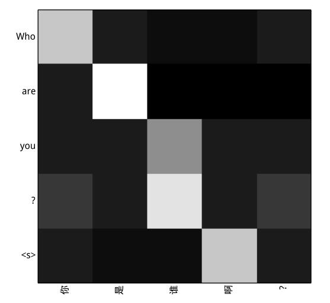
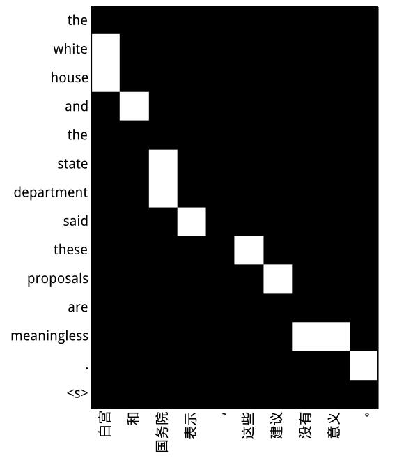

# Draw

**A toolkit for drawing gray scale.**
 

## Usage 
    python draw.py source_file target_file align_file fileout_path

## Sample
result from draw.py

     

result from draw_force.py

     

## Tips 
1.Other files are shown in floder data .  
2.Delete the section with a length greater than 15
